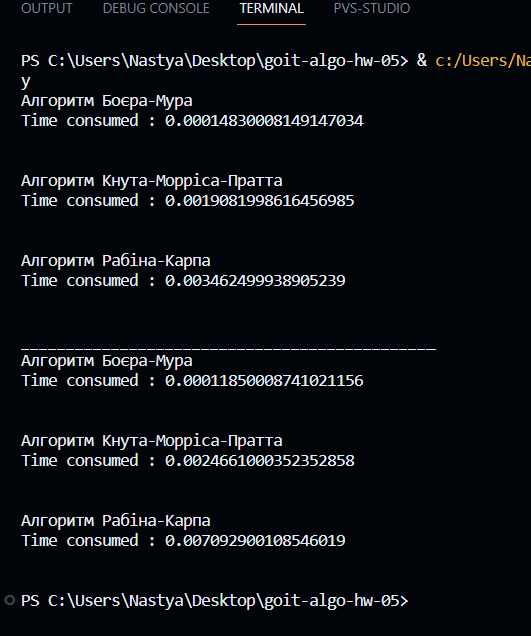

#Результати дослідження порівняння трьох алгоритмів пошуку. Алгоритми Боєра-Мура, Кнута-Морріса-Пратта та Рабіна-Карпа#

Ми провели два дослідження згідно до завдання. Спершу завантажили два текстові файли із гугл диску, прочитали їх та провели пошук за ключовими словами використовуючи кожен із трьох алгоритмів. Дані, що знаходяться над пунтирною лінією, показують, наскільки швидко відбувався пошук у першому тексті із існуючим набором символів. Себто пошук повертав позитивне значення. У цьому випадку найшвидше впорався алгоритм алгоритм Боєра-Мура.

Наступний експеримент був пов'язаний із пошуком неіснуючих у тексті наборів символів (дані під пунктирною лінією). Видно, що у цьому випадку алгоритм Боєра-Мура також впорався швидше.
